SparkFun RTK Firmware Uploader
========================================


The RTK Firmware Uploader is a simple, easy to use method for updating the firmware on SparkFun RTK products. Available on all major platforms, as well as a Python package, the Uploader simplifies working with SparkFun RTK products. 

# Contents

* [Notes](#notes)
* [Using the RTK Firmware Uploader](#using-the-rtk-firmware-uploader)
    * [Upload Firmware](#upload-firmware)
    * [Extras](#extras)
        * [Reset ESP32](#reset-esp32)
        * [Erase Flash](#erase-flash)
* [Installation](#installation)
    * [Windows Installation](#windows)
    * [macOS Installation](#macos)
        * [Install the CH340 USB drivers](#install-the-ch340-usb-drivers)
        * [Download and install the RTK Uploader](#download-and-install-the-rtk-uploader)
        * [Launch the RTK Uploader application](#launch-the-rtk-uploader-application)
    * [Linux Installation](#linux)
    * [Python Package](#python-package)
        * [Raspberry Pi](#raspberry-pi)

# Notes:

From v1.6.0, this GUI does not contain a copy of ```esptool.py```. Instead the latest ```esptool.py``` is installed and used by the build workflow. If you want to run ```RTK_Firmware_Upload.py``` locally, you will need to ```pip install esptool``` first. v1.7.0 of the GUI was written for and tested with v4.8.1 of esptool.

# Using the RTK Firmware Uploader
  
## Upload Firmware
  
* Attach the RTK product over USB
* Click the ```COM Port``` combo box and select the correct COM port from the dropdown menu


* Adjust the Baud Rate if desired
* Click ```Browse``` and select the firmware file you'd like to upload (the filename should end in *.bin*)
    * For RTK Firmware: [SparkFun_RTK_Firmware_Binaries repo on GitHub](https://github.com/sparkfun/SparkFun_RTK_Firmware_Binaries)
        * The previous versions of RTK Firmware are in a [separate folder](https://github.com/sparkfun/SparkFun_RTK_Firmware_Binaries/tree/main/PreviousVersions)
    * For RTK Everywhere Firmware: [SparkFun_RTK_Everywhere_Firmware_Binaries](https://github.com/sparkfun/SparkFun_RTK_Everywhere_Firmware_Binaries)
        * The previous versions of RTK Everywhere are in a [separate folder](https://github.com/sparkfun/SparkFun_RTK_Everywhere_Firmware_Binaries/tree/main/PreviousVersions)

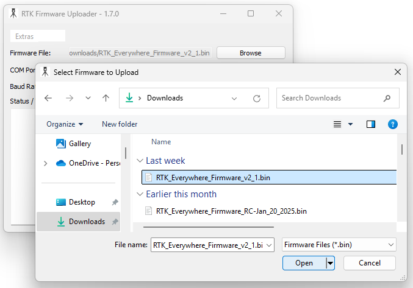

* Click the  ```Upload Firmware``` button to update the firmware

The selected firmware is then uploaded to the connected SparkFun RTK product. Upload information and progress are displayed in the output portion of the interface. 


## Extras

From version 1.6.1, the ```Extras``` pull-down menu contains options to: read the ESP32 WiFi MAC address; reset the ESP32; erase the ESP32.

### Reset ESP32

Clicking the ```Reset ESP32``` button will reset the ESP32 processor. This is helpful when the firmware update succeeds but does not reset the RTK correctly.
If your RTK 'freezes' after the update, pressing ```Reset ESP32``` will get it going again.

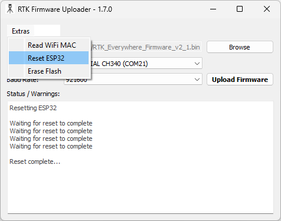

### Erase Flash

Clicking the ```Erase Flash``` button will completely erase the ESP32 flash memory - including the LittleFS file system. This can be useful if you need to completely reset the firmware settings.

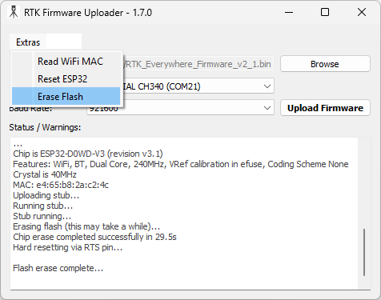

# Installation

Installation binaries are available for all major platforms (macOS, Window, and Linux) on the release page of the RTK Uploader GitHub repository:

[**RTK Uploader Release Page**](https://github.com/sparkfun/SparkFun_RTK_Firmware_Uploader/releases)

Click the arrow next to **Assets** if required to see the installers:


## Windows

* Download the [github release](https://github.com/sparkfun/SparkFun_RTK_Firmware_Uploader/releases) zip file - *RTKUploader.win.zip*


* Right-click the *RTKUploader.win.zip* and select "Extract All" to unzip it


* This results in the application executable, *RTKUploader.exe*


* Double-click *RTKUploader.exe* to start the application
* The executable isn't signed, so you will see a *Windows protected your PC* warning


* Click *More info* and *Run anyway* to run the executable


## macOS

### Install the CH340 USB drivers

Before you begin, check you have drivers for the CH340 USB interface chip installed:

* Full instructions can be found in our [CH340 Tutorial](https://learn.sparkfun.com/tutorials/how-to-install-ch340-drivers/all#mac-osx)
* Here is a link to the WCH downloads page for the [CH340 / CH341 macOS driver](https://www.wch-ic.com/downloads/CH341SER_MAC_ZIP.html)
* The Zip file contains more instructions: CH34X_DRV_INSTAL_INSTRUCTIONS.pdf

### Download and install the RTK Uploader

To download and install the RTK Uploader:

* Download the [github release](https://github.com/sparkfun/SparkFun_RTK_Firmware_Uploader/releases) file - *RTKUploader.dmg*


* Click on the Downloads icon, then double-click the *RTKUploader.dmg* file to mount the disk image

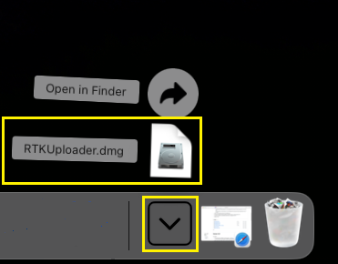

* A Finder window, with the contents of the file will open

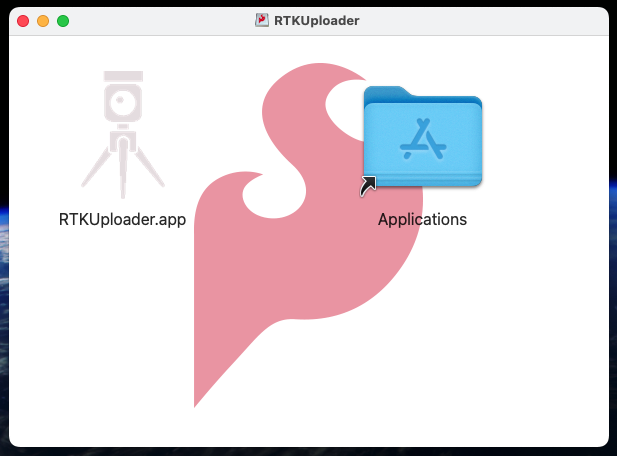

* Install the *RTKUploader.app* by dragging it onto the *Applications* folder

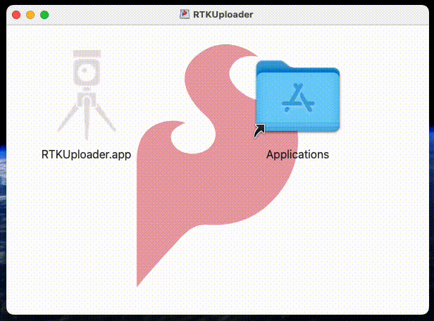

* Unmount the RTKUploader disk image by opening Finder and ejecting it

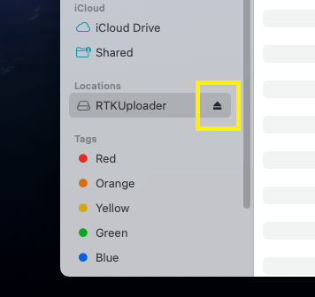

### Launch the RTK Uploader application

To launch the RTK Uploader application:

* Double-click RTKUploader.app to launch the application

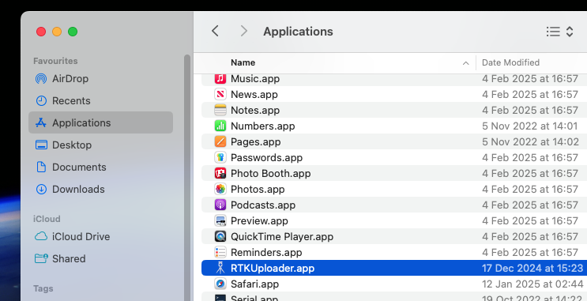

* The RTKUploader.app isn't signed, so macOS won't run the application, and will display a warning dialog. Click **Done**

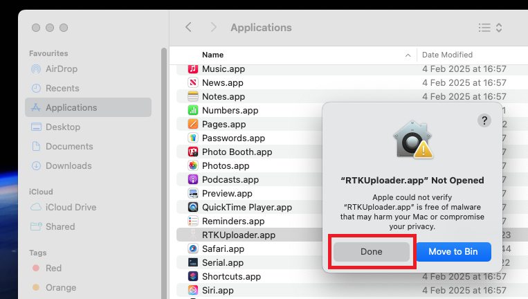

* To approve app execution bring up the macOS *System Settings* and navigate to *Privacy & Security*
* On this page, select the *Open Anyway* button to launch the RTKUploader application

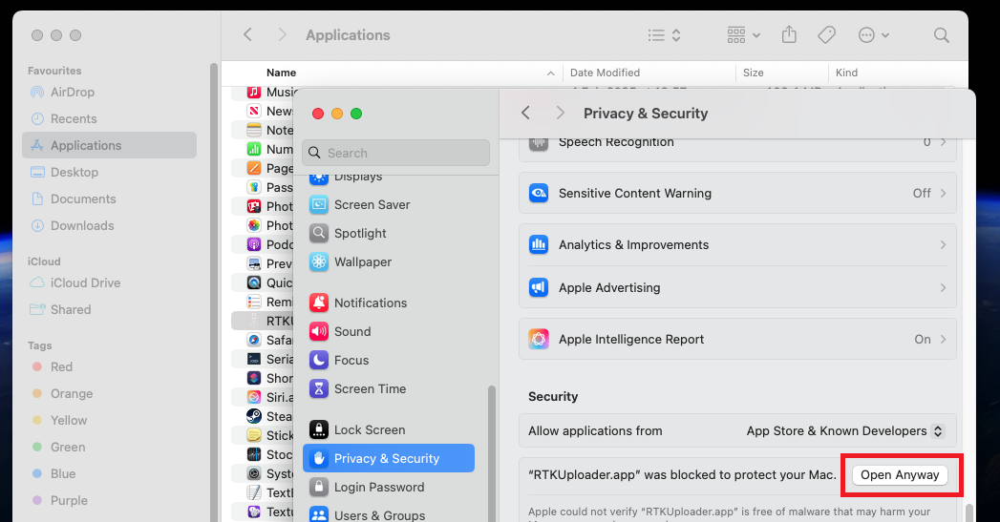

* Once selected, macOS will present one last dialog. Select **Open Anyway** to run the application

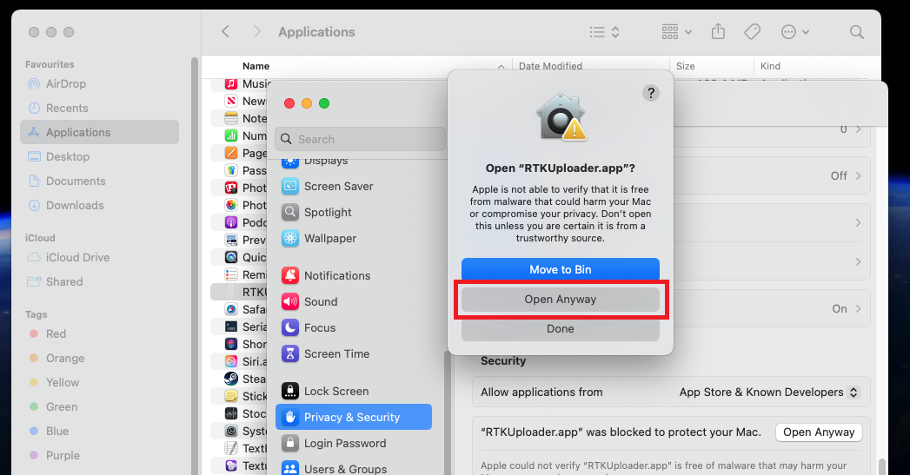

* Enter your password and click OK. The RTKUploader will now start

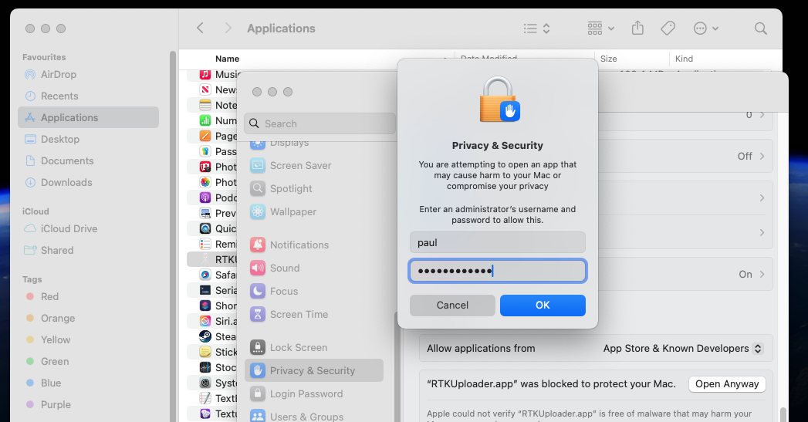

* Select the Firmware File using the Browse button. Select the WCH **cu.wchusbserial** port. Ignore the tty.wchusbserial port

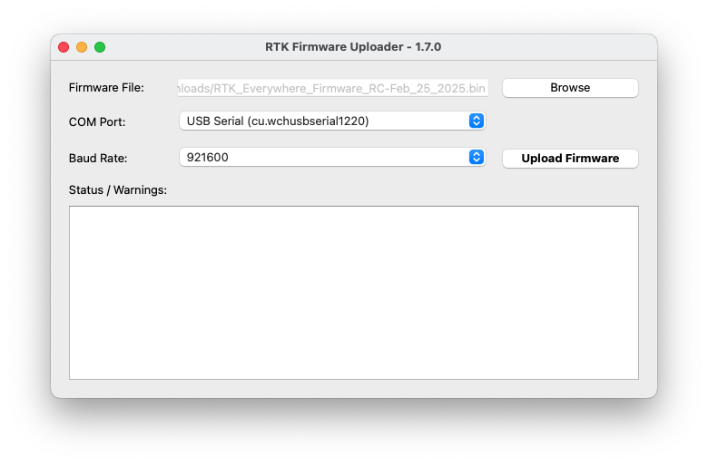

## Linux

* Download the [github release](https://github.com/sparkfun/SparkFun_RTK_Firmware_Uploader/releases) file - *RTKUploader.linux.gz*
* Un-gzip the file, either by double-clicking in on the desktop, or using the `gunzip` command in a terminal window. This results in the file *RTKUploader* 
* To run the application, the file must have *execute* permission. This is performed by selecting *Properties* from the file right-click menu, and then selecting permissions. You can also change permissions using the `chmod` command in a terminal window
* Once the application has execute permission, you can start the application a terminal window. Change directory's to the application location and issue `./RTKUploader`
* You may need to install drivers for the CH340 USB interface chip. Full instructions can be found in our [CH340 Tutorial](https://learn.sparkfun.com/tutorials/how-to-install-ch340-drivers/all#linux)

## Python Package

The RTK Firmware Uploader is also provided as an installable Python package. This is advantageous for platforms that lack a pre-compiled application. 

To install the Python package:
* Download the package file - *python-install-package.zip*
* Unzip the github release file. This results in the installable Python package file - *RTK_Firmware_Uploader-1.6.0.tar.gz* (note - the version number might vary)

At a command line - issue the package install command:

* `pip install RTK_Firmware_Uploader-1.6.0.tar.gz`
* Once installed, you can start the RTK Uploader App by issuing the command `./RTK_Formware_Upload` at the command line. (To see the command, you might need to start a new terminal, or issue a command like `rehash` depending on your platform/shell)

Notes:
* A path might be needed to specify the install file location.
* Depending on your platform, this command might need to be run as admin/root
* Depending on your system, you might need to use the command `pip3`

### Raspberry Pi
We've tested the Uploader on both 32-bit and 64-bit Raspberry Pi Debian. You will need to use the **Python Package** to install it.

Notes:
* On 32-bit Raspberry Pi, with both Python 2 and Python 3 installed, use `sudo pip3 install RTK_Firmware_Uploader-1.6.0.tar.gz`
  * By default, the executable will be placed in `/usr/local/bin`
* On 64-bit Raspberry Pi, use `sudo pip install RTK_Firmware_Uploader-1.6.0.tar.gz`
* The `sudo` is required to let `setup.py` install `python3-pyqt5` and `python3-pyqt5.qtserialport` using `sudo apt-get install`


